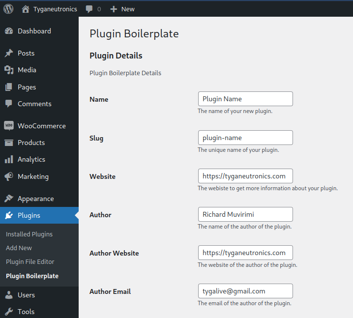
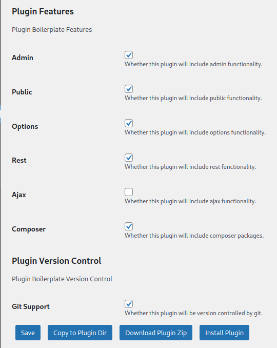

## Plugin Bolierplate

Easily create WordPress plugins from the comfort of your WordPress backend.

### Description

Create and download plugins from your WordPress installation backend.
This is useful for example when you are developing in a local environment and want to get started quickly without the hassle of downloading online.
The plugin template used is based on [WordPress Plugin Boilerplate](https://github.com/devinvinson/WordPress-Plugin-Boilerplate/)

Have discovered everytime i have to create a new plugin i had to go onto the internet and download a boilerplate copy and manually install. This can pretty much get old quickly especially if working on WordPress projects back to back.

##### Features:

* Create plugin directly into the WordPress install
* Download generated plugin
* Save plugin details for use later
* Automatically fill in plugin details

### Installation

This section describes how to install the plugin and get it working.

e.g.

1. Upload `plugin-boilerplate.php` to the `/wp-content/plugins/` directory
1. Activate the plugin through the 'Plugins' menu in WordPress
1. Place `<?php do_action('plugin_name_hook'); ?>` in your templates

### Frequently Asked Questions

#### Does my server need to be connected to the internet?

No this plugin works out of the box already loaded with all the assets it requires.

### Changelog

#### 1.0
* Initial Launch

### Upgrade Notice

#### 1.0
* Initial Launch

